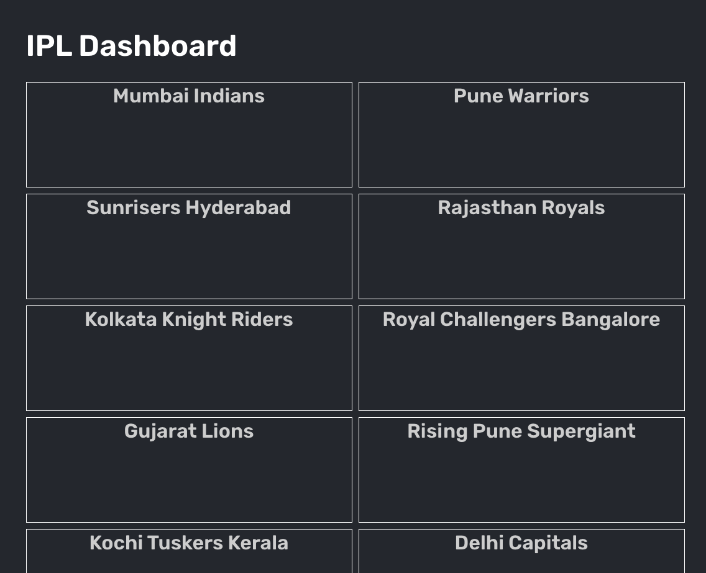
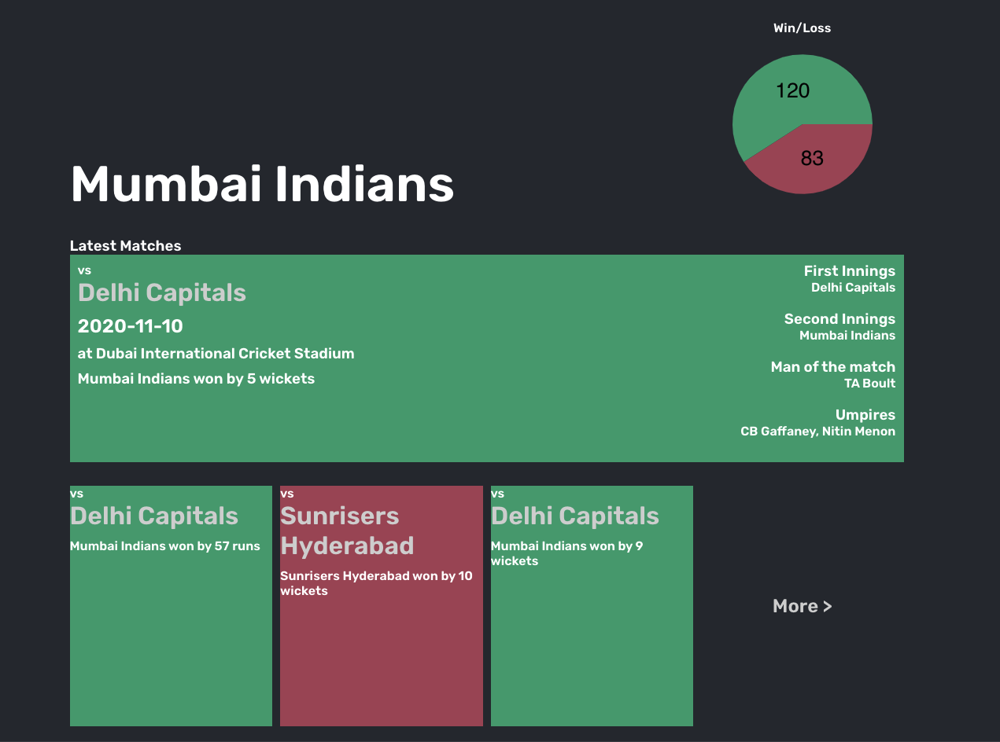
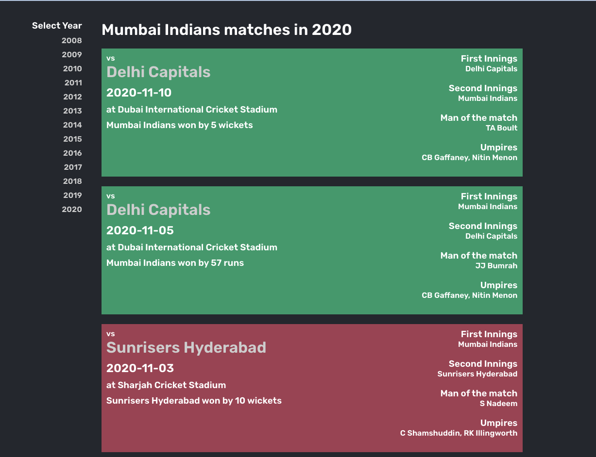

## Introduction
This is a full stack app built using spring boot and react. It's also using HSQL as an in-memory database to persist the data. During startup application ingest data to database from src/main/resources/match-data.csv using spring-batch.

### Running frontend
```
cd src/frontend && npm start
```
Make sure to uncomment REACT_APP_API_ROOT_URL property having service url in .env file.

### Running spring boot app
```
mvn spring-boot:run
```

### Package
```
mvn clean install
```
Above command will package the frontend and backend application in a single jar file. Running the jar file e.g. ```java -jar target/ipl-dashboard-0.0.1-SNAPSHOT.jar ``` will run both and frontend and backend. Following maven plugin has been used to package frontend application as part of jar. The plugin does node and npm install and eventually copies the generated frontend artifact into public folder. This makes frontend application available at http://localhost:8080/

```
<groupId>com.github.eirslett</groupId>
<artifactId>frontend-maven-plugin</artifactId>
```


## Application

### Dashboard Page



### Team Page



### Matches Page

